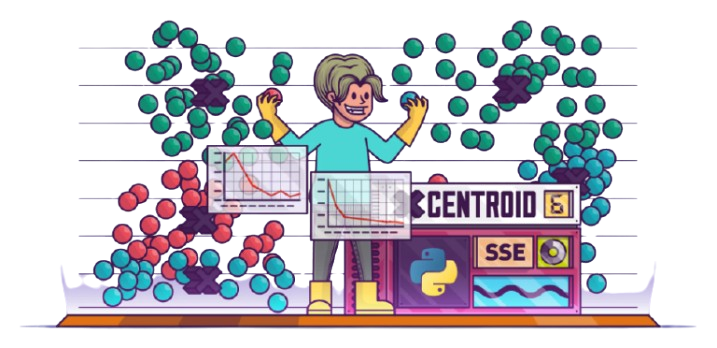

# CUDA K-Means Image Clustering

<p align="center">
  
</p>

##   Table of Content
1. [Overview](#Overview)
2. [Results](#Results)
3. [Get Started](#started)
4. [Contributors](#contributors)
5. [License](#license)


##  Overview <a id="Overview"></a>

This tool takes an RGB image as input and applies clustering based on the number of centroids you specify. It also calculates the silhouette score to assess the quality of the clustering. Powered by CUDA parallelization, the process is optimized for high performance. :D

##  Results <a id = "Results"></a>

### Simple Image Low RESOLUTION

|  |  |
|----------------------------------|------------------------------------------------------------------|

### 4K Image

|  |  |
|-----------------------------------|--------------------------------------------------------|

## Get Started <a id = "started"></a>

### Clustering
---------------------------------------------------------
### 1. Navigate to the Main Project Directory
```bash
cd ./
```

### 2. Compile Code
```bash
nvcc -o out_gpu_3_stream_0  ./src/gpu_3_stream_0.cu
```

### 3. Run the Code
Specify Parameters: `<path_to_image> <number_of_clusters>`  
Note: The number of clusters must be less than 20 😊
```bash
./out_gpu_3_stream_0 ./tests/image_3.png 5
```

### 4. Profile Results
```bash
nvprof ./out_gpu_3_stream_0 ./tests/image_3.png 5
```

### Clustering + Compute Silhouette Score
---------------------------------------------------------
### 1. Navigate to the Main Project Directory
```bash
cd ./
```

### 2. Compile Code
```bash
nvcc -o out_gpu_3_stream_0_sihouette  ./src/gpu_3_stream_0_sihouette.cu
```

### 3. Run Code
Specify Parameters: `<path_to_image> <number_of_clusters>`  
Note: The number of clusters must be less than 20 😊
```bash
./out_gpu_3_stream_0_sihouette ./tests/image_3.png 5
```

### 4. Profile Results
```bash
nvprof ./out_gpu_3_stream_0_sihouette ./tests/image_3.png 5
```

<!-- Contributors -->

##  Contributors <a id = "contributors"></a>

<!-- Contributors list -->
<table align="center" >
  <tr>
    <td align="center"><a href="https://github.com/BasmaElhoseny01"><br /><sub><b>Basma Elhoseny</b></sub></a><br /></td>
        <td align="center"><a href="https://github.com/SarahElzayat"><br /><sub><b>Sarah Elzayat</b></sub></a></td>

  </tr>
</table>

##   License
This software is licensed under the [MIT License](https://github.com/BasmaElhoseny01/K-Means-Clustering-CUDA/blob/main/LICENSE). © Basma Elhoseny.