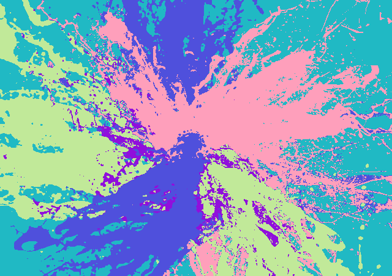

# CUDA Kmeans Image Clustering

##  Overview <a id = "Overview"></a>

Given a RGB Image, You will get a clustered image with the no of centroids you specify and you can get silhouette score to see accuracy of our clustering techniques using CUDA paralyzation :D

## Results

### Simple Image Low RESOLUTION




### 4K Image


## Get Started <a id = "started"></a>

### Kmeans Clustering For Image

##### Go to the main directory of the project

```
cd ./
```

##### Compile Code

```
nvcc -o out_gpu_3_stream_0  ./gpu_3_stream_0.cu
```

#### Run Code

##### Specify Parameters <path_to_image> <no_of_clusters>

no of clusters must be less than 20 😊

```
./out_gpu_3_stream_0 .\tests\image_3.png 5
```

#### Profile Results

```
nvprof ./out_gpu_3_stream_0 ./tests/image_3.png 5
```

### Kmeans Clustering + Compute Silhouette Score

#### Compile Code

```
nvcc -o out_gpu_3_stream_0_sihouette  ./gpu_3_stream_0_sihouette.cu
```

#### Run Code

##### Specify Parameters <path_to_image> <no_of_clusters>

no of clusters must be less than 20 😊

```
./out_gpu_3_stream_0_sihouette .\tests\image_3.png 5
```

#### Profile Results

```
nvprof ./out_gpu_3_stream_0_sihouette ./tests/image_3.png 5

```

<!-- Contributors -->

##  Contributors <a id = "contributors"></a>

<!-- Contributors list -->
<table align="center" >
  <tr>
    <td align="center"><a href="https://github.com/BasmaElhoseny01"><br /><sub><b>Basma Elhoseny</b></sub></a><br /></td>
        <td align="center"><a href="https://github.com/SarahElzayat"><br /><sub><b>Sarah Elzayat</b></sub></a></td>

  </tr>
</table>
